# Raspberry Pi One-Time Setup

This guide walks through setting up a **brand new Raspberry Pi** to run TrailCurrent. These steps are performed once per device. After this, all future updates are handled by the deployment package (`deploy.sh`).

---

## Prerequisites

### Flash the SD Card

Download and install **Raspberry Pi Imager v2.0.6 or newer**. Older versions (1.9.x and below) will silently fail to apply OS customisation settings on Trixie-based images.

> **Important:** As of early 2026, neither apt (ships 1.8.5) nor snap (ships 1.9.6) provide a new enough version. Download v2.0.6+ directly from the [GitHub releases page](https://github.com/raspberrypi/rpi-imager/releases):
>
> - **Windows** — `imager-v2.0.6.exe`
> - **macOS** — `rpi-imager-v2.0.6.dmg`
> - **Linux (deb)** — `rpi-imager_2.0.6_amd64.deb`, then install with `sudo apt install ./rpi-imager_2.0.6_amd64.deb` (using `apt` instead of `dpkg` ensures dependencies are resolved automatically; if the download fails with a `dpkg-deb` error, re-download the file — it was likely truncated)
> - **Linux (AppImage)** — `Raspberry_Pi_Imager-v2.0.6-desktop-x86_64.AppImage`, then `chmod +x` and run directly

Insert the SD card into your development machine and launch the Imager. Pi Imager v2.0.6 uses a step-by-step wizard — each screen is accessed via the sidebar on the left.

**1. Device** — Select your Raspberry Pi model (Pi 4 or Pi 5).

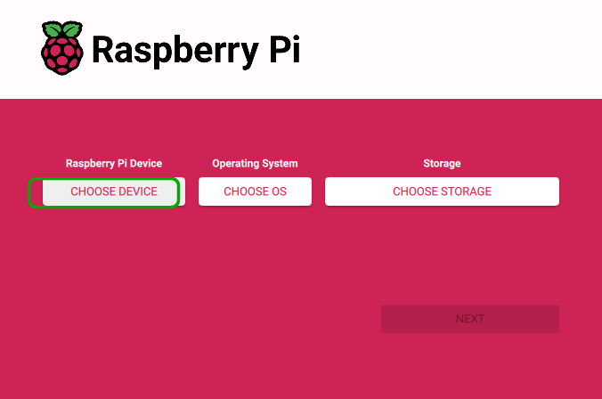

**2. OS** — Select **Raspberry Pi OS (other)** to see additional options.

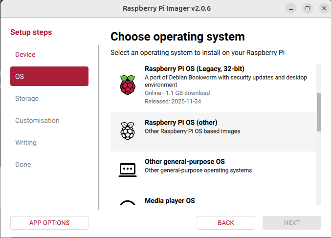

Then select **Raspberry Pi OS Lite (64-bit)**. This is the headless version (no desktop environment) based on Debian Trixie.

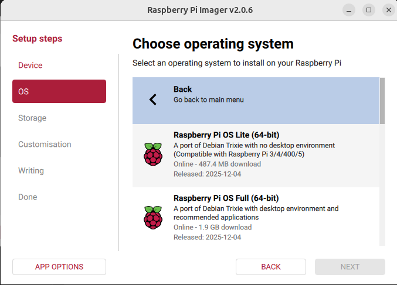

**3. Storage** — Select your SD card.

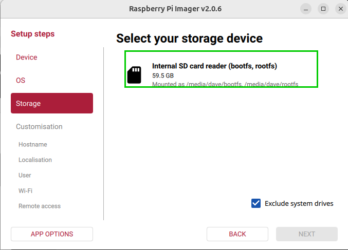

**4. Customisation** — After selecting storage, the wizard moves into the customisation steps. Do **not** click **SKIP CUSTOMISATION** — these settings are required for SSH access on first boot.

**Hostname** — Enter a hostname for the Pi. This name identifies the device on the network (reachable via `<hostname>.local` once Avahi is installed).

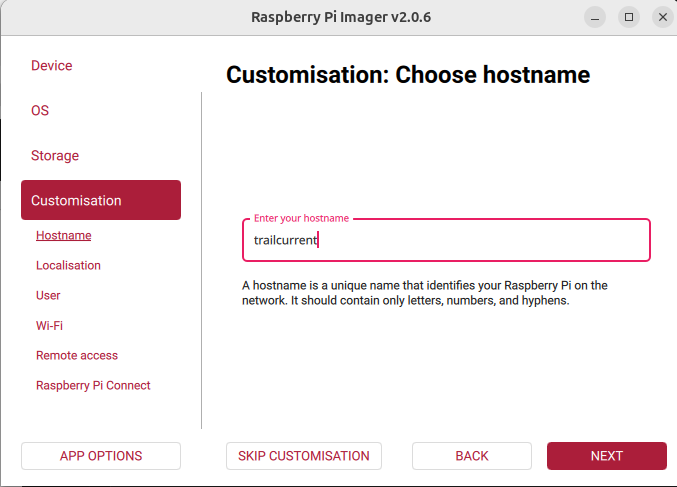

**Localisation** — Select your capital city to set the WiFi regulatory domain, then adjust the **Time zone** and **Keyboard layout** dropdowns as needed. For US users, select **Washington, D.C. (United States)** as the capital city — this defaults to Eastern time. Change the **Time zone** dropdown to your local zone (e.g. `America/Chicago` for Central).

> **Tip:** The capital city dropdown contains several hundred entries. Type the first letter of the city name to jump to that section, or use arrow keys to scroll.

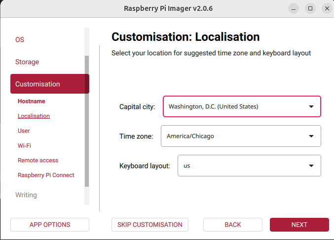

**User** — Create a username and password. You will use these credentials to SSH into the Pi. The username must be lowercase.

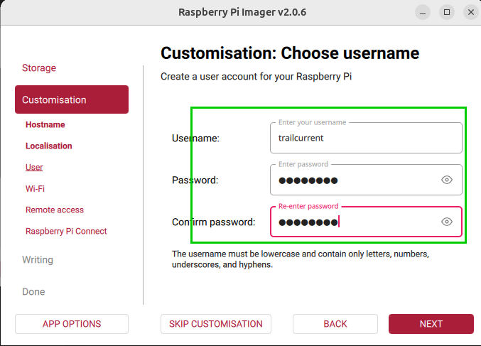

**Wi-Fi** — If the Pi will use a wired Ethernet connection, **clear the SSID field** (delete any text) so Pi Imager skips WiFi configuration. If you need WiFi, enter your network SSID and password.

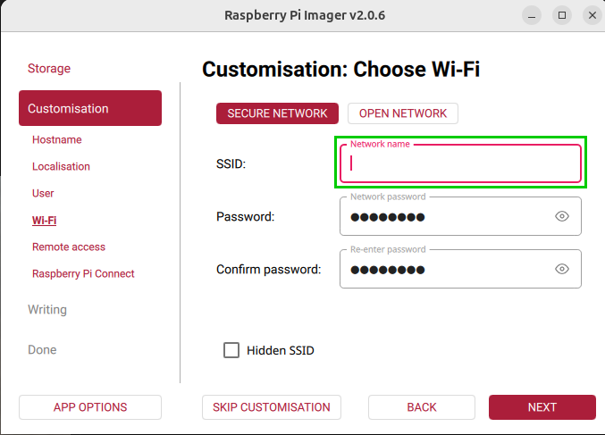

**Remote access** — Enable **SSH** and select **Use password authentication**.

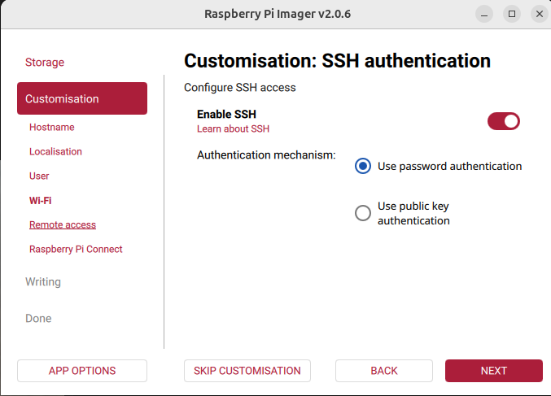

**Raspberry Pi Connect** — Leave this **disabled**. It is not needed for TrailCurrent.

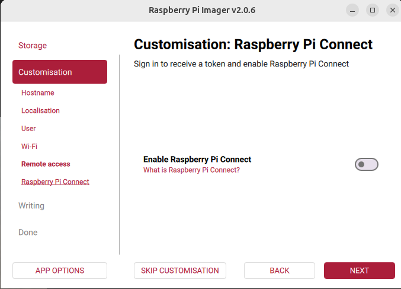

**5. Write** — Review the summary to verify your selections, then click **WRITE**.

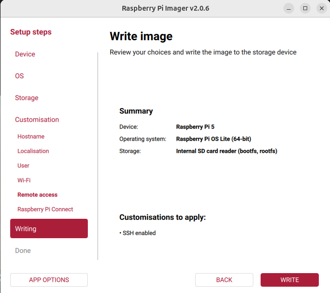

Confirm by clicking **I UNDERSTAND, ERASE AND WRITE** to begin flashing.

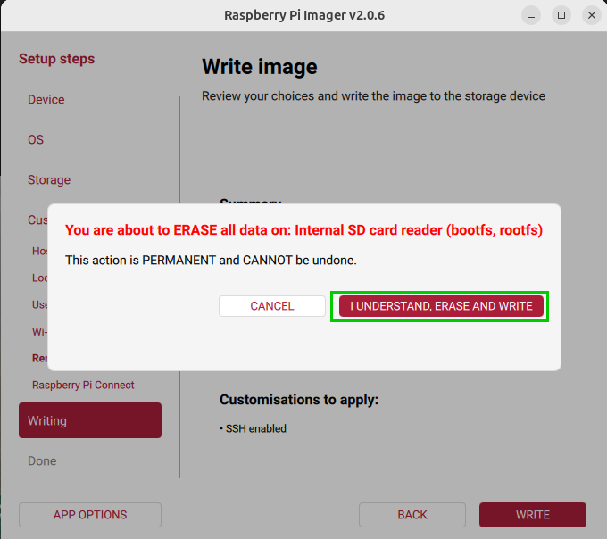

### Hardware

- Raspberry Pi 4 or 5 (8GB RAM recommended)
- TrailCurrent Pi Hat (plugs directly onto the GPIO header)
- microSD card (32GB+) or NVME Drive via NVME Base

---

## Step 1: Insert the SD Card

Insert the flashed SD card into the Pi's microSD slot.

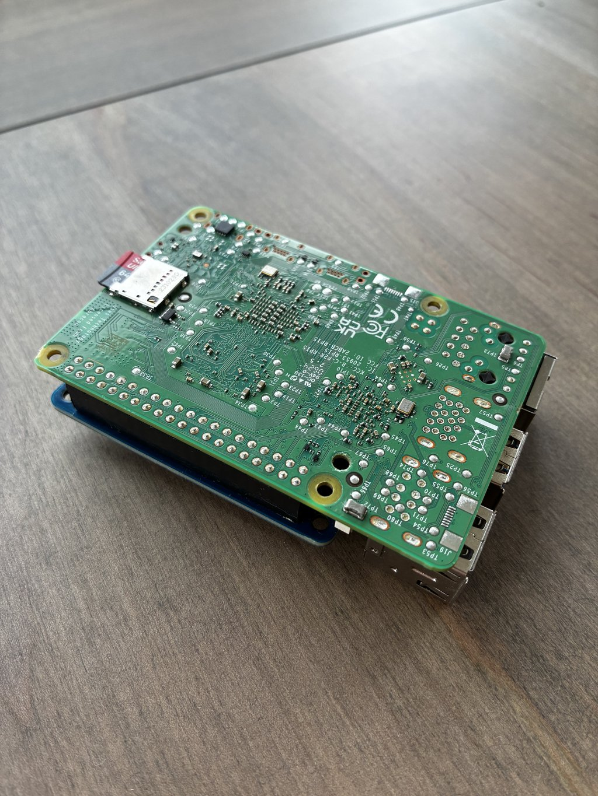
---

## Step 2: Install the TrailCurrent CAN Hat

With the Pi powered off, install the TrailCurrent CAN Hat onto the Pi 5 GPIO header.

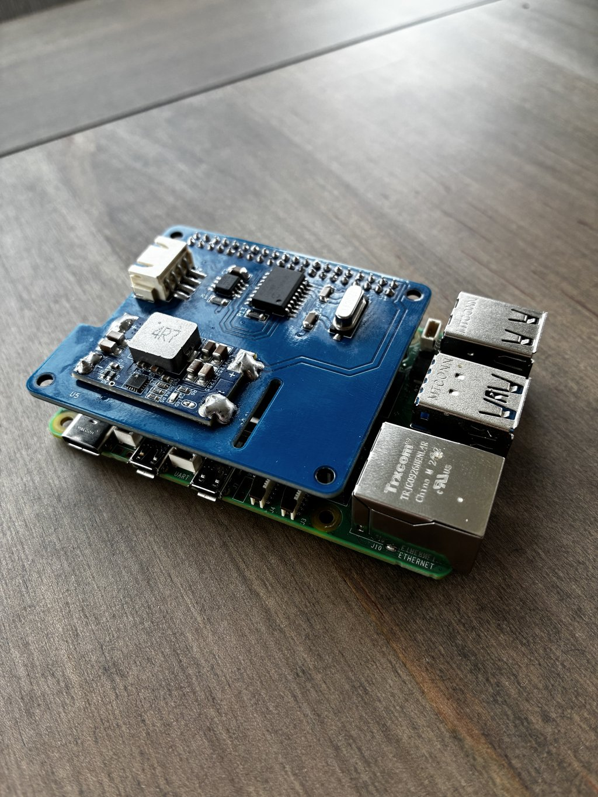


Connect the JST XH 4-pin cable (JST S4B-XH-SM4-TB) to the hat. The pinout from left to right is:


> **WARNING:** There is no reverse polarity protection on this circuit. Incorrect wiring will damage the Pi. Double-check the pinout before applying power.
---

## Step 3: Connect to the Network

Plug the Pi into an available LAN port on your WiFi router using an Ethernet cable.

---

## Step 4: Boot the Pi

Connect power to the Pi so that it boots.

---

## Step 5: Transfer and Run the Setup Script

On your development machine, open a terminal and navigate to the directory where you cloned this repository. Then transfer the setup script to the Pi:

```bash
cd <path-to-your-clone>/TrailCurrentInVehicleCompute
scp rpi_one_time/setup-pi.sh <username>@<pi-ip-address>:~/
```

SSH into the Pi and run it:

```bash
ssh <username>@<pi-ip-address>
chmod +x ~/setup-pi.sh
sudo ~/setup-pi.sh
```

The script installs and configures everything automatically:

| Step | What it does |
|------|-------------|
| 1 | Updates system packages (`apt-get update && upgrade`) |
| 2 | Installs dependencies: `jq`, `openssl`, `python3`, `python3-venv`, `can-utils`, `avahi`, `curl`, `unzip` |
| 3 | Installs Docker and Docker Compose plugin, enables on boot |
| 4 | Enables SPI interface via `raspi-config` |
| 5 | Adds MCP2515 CAN bus overlay to boot config (12MHz oscillator, GPIO25 interrupt) |
| 6 | Installs `can0.service` systemd unit to auto-start CAN interface at 500kbps |
| 7 | Adds your user to the `docker` group |
| 8 | Configures auto-boot on power — Pi 5 only (no power button needed in vehicle) |
| 9 | Creates Python virtual environment at `~/local_code/cantomqtt` |
| 10 | Installs and enables the `cantomqtt` systemd service |
| 11 | Creates the deployment directory structure at `~/trailcurrent/` |
| 12 | Generates TLS/SSL certificates using the Pi's hostname (10-year validity) |

---

## Step 6: Reboot

A reboot is required for SPI and the CAN overlay to take effect:

```bash
sudo reboot
```

---

## Step 7: Verify

After the Pi comes back up, SSH in and verify:

```bash
# Should list /dev/spidev0.1 (spidev0.0 is claimed by the MCP2515 CAN overlay)
ls /dev/spidev0.*

# Should show the can0 interface — confirms the SPI overlay and MCP2515 driver are loaded
ip link show can0

# Should print a version string (e.g. "Docker version 27.x.x")
docker --version

# Should print a version string (e.g. "Docker Compose version v2.x.x")
docker compose version
```

> **Note:** After setup and reboot, `can0` should show `state UP`. If it shows `state DOWN` with `qdisc noop`, the `can0.service` did not start — check with `systemctl status can0.service`.

If `can0` does not appear at all, the CAN hat overlay or wiring may be incorrect. If any command is not found, re-run the setup script.

---

## Step 8: Transfer Map Tiles

The map tiles file **must** be in place before running `deploy.sh`. If it is missing, Docker will create a root-owned directory at the mount point, which breaks the tileserver and requires manual cleanup (`sudo rm -rf ~/trailcurrent/data/tileserver/us-tiles.mbtiles` then re-create as a file).

From your development machine:

```bash
scp us-tiles.mbtiles <username>@<hostname>.local:~/trailcurrent/data/tileserver/us-tiles.mbtiles
```

The `~/trailcurrent/data/tileserver/` directory was already created by the setup script. See [UpdatingMapTiles.md](UpdatingMapTiles.md) for how to obtain or generate this file.

---

## Next Steps

Your Pi is now ready for application deployment:

1. **Create a deployment package** on your development machine (see [PI_DEPLOYMENT.md](../PI_DEPLOYMENT.md)):
   ```bash
   ./create-deployment-package.sh --version=1.0.0
   ```

2. **Transfer the zip to the Pi**:
   ```bash
   scp trailcurrent-deployment-1.0.0.zip <username>@<hostname>.local:~/trailcurrent/
   ```

3. **Deploy**:
   ```bash
   cd ~/trailcurrent
   unzip trailcurrent-deployment-1.0.0.zip
   ./deploy.sh
   ```

On first run, `deploy.sh` will prompt you to configure `.env` with your credentials. TLS certificates were already generated during setup using the Pi's hostname. See [PI_DEPLOYMENT.md](../PI_DEPLOYMENT.md) for the full deployment walkthrough.

---

## Reference

| Document | Purpose |
|----------|---------|
| [PI_DEPLOYMENT.md](../PI_DEPLOYMENT.md) | Deploying and updating the application |
| [PiSetup.md](PiSetup.md) | Application-level configuration (env, certs, tiles) |
| [UpdatingMapTiles.md](UpdatingMapTiles.md) | Generating and updating map tile data |
