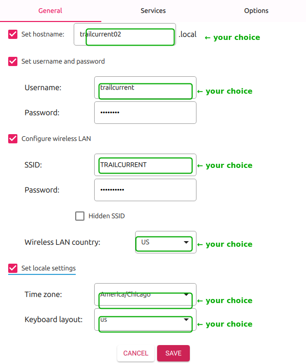
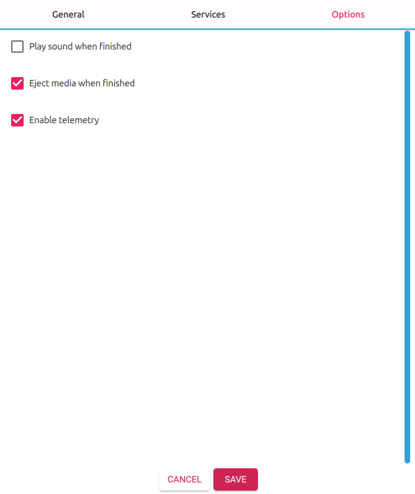
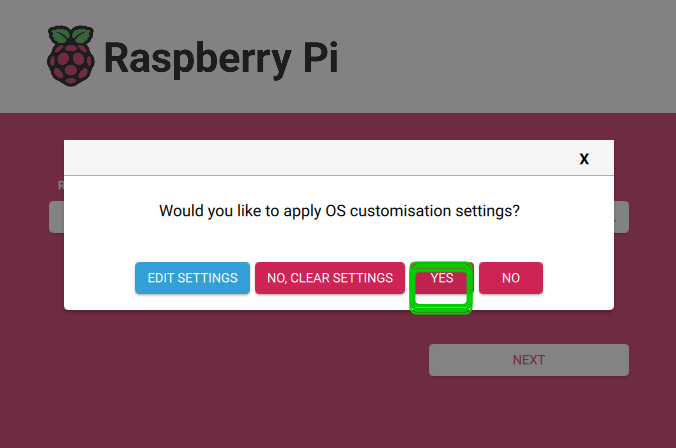

# Raspberry Pi One-Time Setup

This guide walks through setting up a **brand new Raspberry Pi** to run TrailCurrent. These steps are performed once per device. After this, all future updates are handled by the deployment package (`deploy.sh`).

---

## Prerequisites

### Flash the SD Card

Use the [Raspberry Pi Imager](https://www.raspberrypi.com/software/) to flash **Raspberry Pi OS Lite (64-bit)**. Configure the OS customisation settings before flashing:

**General tab** — Set the hostname, username, password, WiFi SSID/password, and locale. WiFi is required for SSH access, deployment transfers, and the web UI.



**Services tab** — Enable SSH with password authentication.


**Options tab** — Uncheck **"Eject media when finished"** so the SD card stays mounted for the SSH verification step below.



Click **SAVE**. When prompted to apply OS customisation settings, click **YES** to begin flashing.



### Verify SSH Is Enabled

Pi Imager sometimes fails to apply SSH settings. After flashing completes (with the SD card still mounted), verify SSH is enabled on the boot partition:

```bash
# Check if the ssh file exists on the boot partition (path may vary)
ls /media/$USER/bootfs/ssh

# If the file does not exist, create it:
touch /media/$USER/bootfs/ssh
```

Safely eject the SD card after confirming the file exists.

### Hardware

- Raspberry Pi 4 or 5 (8GB RAM recommended)
- TrailCurrent Pi Hat (plugs directly onto the GPIO header)
- microSD card (32GB+) or NVME Drive via NVME Base

---

## Step 1: Get the Setup Script onto the Pi

Boot the Pi and SSH in:

```bash
ssh <username>@<pi-ip-address>
```

Transfer the `rpi_one_time` folder from this repository to the Pi. For example, from your development machine:

```bash
scp -r rpi_one_time/ <username>@<pi-ip-address>:~/
```

---

## Step 2: Run the Setup Script

```bash
cd ~/rpi_one_time
sudo ./setup-pi.sh
```

The script installs and configures everything automatically:

| Step | What it does |
|------|-------------|
| 1 | Updates system packages (`apt-get update && upgrade`) |
| 2 | Installs dependencies: `jq`, `openssl`, `python3`, `python3-venv`, `can-utils`, `avahi`, `curl`, `unzip` |
| 3 | Installs Docker and Docker Compose plugin, enables on boot |
| 4 | Enables SPI interface via `raspi-config` |
| 5 | Adds MCP2515 CAN bus overlay to boot config (12MHz oscillator, GPIO25 interrupt) |
| 6 | Configures `can0` network interface to auto-start at 500kbps |
| 7 | Adds your user to the `docker` group |
| 8 | Configures auto-boot on power — Pi 5 only (no power button needed in vehicle) |
| 9 | Creates Python virtual environment at `~/local_code/cantomqtt` |
| 10 | Installs and enables the `cantomqtt` systemd service |
| 11 | Creates the deployment directory structure at `~/trailcurrent/` |
| 12 | Generates TLS/SSL certificates using the Pi's hostname (10-year validity) |

---

## Step 3: Reboot

A reboot is required for SPI and the CAN overlay to take effect:

```bash
sudo reboot
```

---

## Step 4: Verify

After the Pi comes back up, SSH in and verify:

```bash
# SPI device files should exist
ls /dev/spidev0.*

# CAN interface should be UP
ip link show can0

# Docker should be running
docker --version
docker compose version
```

If `can0` shows `state UP`, the hardware and driver are working.

---

## Step 5: Transfer Map Tiles

The map tiles file **must** be in place before running `deploy.sh`. If it is missing, Docker will create a root-owned directory at the mount point, which breaks the tileserver and requires manual cleanup (`sudo rm -rf ~/trailcurrent/data/tileserver/us-tiles.mbtiles` then re-create as a file).

From your development machine:

```bash
scp us-tiles.mbtiles <username>@<hostname>.local:~/trailcurrent/data/tileserver/us-tiles.mbtiles
```

The `~/trailcurrent/data/tileserver/` directory was already created by the setup script. See [UpdatingMapTiles.md](UpdatingMapTiles.md) for how to obtain or generate this file.

---

## Next Steps

Your Pi is now ready for application deployment:

1. **Create a deployment package** on your development machine (see [PI_DEPLOYMENT.md](../PI_DEPLOYMENT.md)):
   ```bash
   ./create-deployment-package.sh --version=1.0.0
   ```

2. **Transfer the zip to the Pi**:
   ```bash
   scp trailcurrent-deployment-1.0.0.zip <username>@<hostname>.local:~/trailcurrent/
   ```

3. **Deploy**:
   ```bash
   cd ~/trailcurrent
   unzip trailcurrent-deployment-1.0.0.zip
   ./deploy.sh
   ```

On first run, `deploy.sh` will prompt you to configure `.env` with your credentials. TLS certificates were already generated during setup using the Pi's hostname. See [PI_DEPLOYMENT.md](../PI_DEPLOYMENT.md) for the full deployment walkthrough.

---

## Reference

| Document | Purpose |
|----------|---------|
| [PI_DEPLOYMENT.md](../PI_DEPLOYMENT.md) | Deploying and updating the application |
| [PiSetup.md](PiSetup.md) | Application-level configuration (env, certs, tiles) |
| [UpdatingMapTiles.md](UpdatingMapTiles.md) | Generating and updating map tile data |
